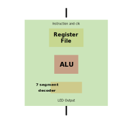

 

# Femto
Femto is a 4-bit CPU that uses a RISC/Accumulator based ISA. It contains a 4-bit ALU, a 4-entry 4-bit register file, and a 7 segment decoder to display values to the LED output.

# Interface
##Input

As per the Tinytapeout requirements, Femto uses an 8-bit input interface. One bit is used for the clock, and reset is omitted from the interface to give more capability to the ISA. Instead, the accumulator must be reset and then stored to all of the registers.

| Instruction |  clk  |
| ----------- | ----- |
|   7 bits    | 1 bit |

##Output

As per the Tinytapeout requirements, Femto uses an 8-bit output interface, with only 7 being used for LED output.

## ISA
Femto uses a 7-bit instruction ISA. The fields and encodings are provided below. If an encoding is not provided, it is reserved. rsvd indicates that the field is reserved, i.e. not used for a given instruction.

### Instruction Fields

| reg_src | reg_dest | opcode |
| ------- | -------- | ------ |
| 2 bits  |  2 bits  | 3 bits |

### Instruction Encodings

#### R-Type

| Encoding |  Instruction  |
| -------- | ------------- |
|  src,dest,010 |  ADD    |
| -------- | ------------- |
|  src,dest,011 |  NOT    |
| -------- | ------------- |
|  src,dest,100 |  AND    |
| -------- | ------------- |
|  src,dest,101 |  XOR    |
| -------- | ------------- |
|  rsvd,dest,110 |  STOREACC    |
| -------- | ------------- |
|  src,rsvd,111 |  DISPLAY    |

#### I-Type

| Encoding |  Instruction  |
| -------- | ------------- |
|  00,00,000 |  NOP    |
| -------- | ------------- |
|  imm[3:2],imm[1:0],001 |  LOADACCI    |

#### CSR Instructions
Femto has additional instructions to alter CPU state

| Encoding |  Instruction  |
| -------- | ------------- |
|  10,00,000 |  Set to IDLE    |
| -------- | ------------- |
|  10,01,000 |  Set to RUN    |
| -------- | ------------- |
|  10,10,000 |  Set to LOADBUF    |

IDLE: CPU does not process any instructions, and cannot write to the instruction buffer.

LOADBUF: Inputs are instructions that are stored to the instruction buffer. The processor can be connected to a system that can automatically load instructions (e.g. via a USB to GPIO solution), or the instructions can be manually input if the board is in single-cycle clock mode if switches are present.

RUN: CPU pops and runs the instructions in the instruction buffer. A NOP is added to the buffer for every instruction read. When the buffer is empty, it will be full of NOPs, and the CPU will effectively be idle, but will still read NOPs until CPU state is changed.

# Feedback

Send an email to mia42@mail.aub.edu

# Tiny Tapeout
# What is Tiny Tapeout?

TinyTapeout is an educational project that aims to make it easier and cheaper than ever to get your digital designs manufactured on a real chip!

Go to https://tinytapeout.com for instructions!

## Resources

* [FAQ](https://tinytapeout.com/faq/)
* [Digital design lessons](https://tinytapeout.com/digital_design/)
* [Join the community](https://discord.gg/rPK2nSjxy8)